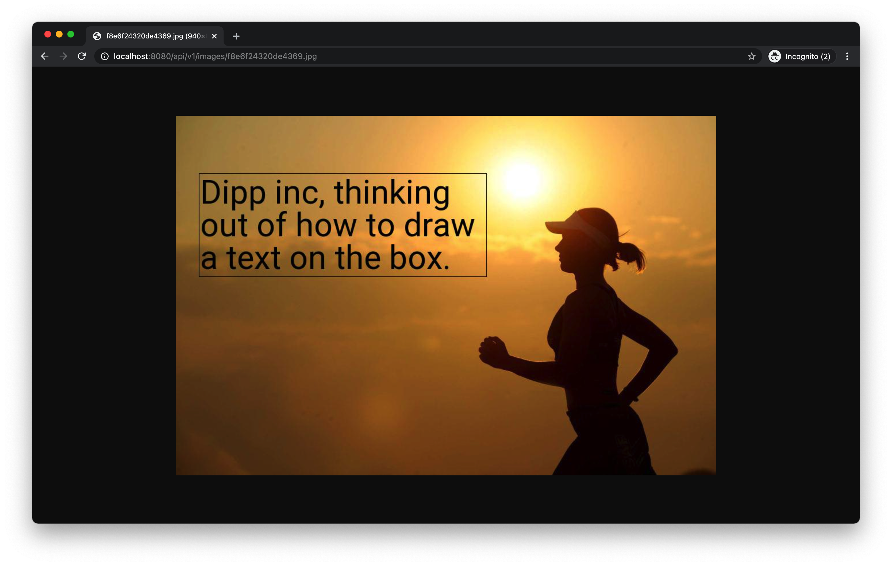

# Text Inside Box

### About


Simple APIs server to determine the suitable font size that will make the **content** fit inside 
the predefined box based on a particular font, and draw this **text box** on an image provided by user.

### Project setup

1. Create a virtual environment
    
    ```shell
    virtualenv -p python3 <name>
    source <name>/bin/activate
    ```

1. Install all requirements

    ```shell
    pip install -r requirements.txt
    ```

1. Run the server

    ```shell
    python manage.py run
    ```
   
1. Run the test cases

    ```shell
    python -m pytest -v
    ```


### Main features

#### Draw a text box inside the image

The input data should look like this:

```json
{
    "font_url": "https://storage.googleapis.com/dipp-massimo-development-fonts/4f2cf2b6b99d96ca.ttf",
    "image_url": "https://storage.googleapis.com/dipp-massimo-development-images/1f1282fef735f349.jpg",
    "text": {
        "content": "Dipp inc, thinking out of how to draw a text on the box.",
        "text_color": "#000000",
        "border_color": "#000000"
    },
    "box": {
        "x": 40,
        "y": 100,
        "width": 500,
        "height": 180
    }
}
```

The API should respond with an output similar to the following:

```json
{
    "resource": "http://localhost:8080/api/v1/images/82a78a5d46b443cd.jpg",
    "splits": [
        {
            "content": "Dipp inc, thinking",
            "font_size": 57,
            "x": 40,
            "y": 100
        },
        {
            "content": "out of how to draw",
            "font_size": 57,
            "x": 40,
            "y": 157
        },
        {
            "content": "a text on the box.",
            "font_size": 57,
            "x": 40,
            "y": 214
        }
    ],
    "box": {
        "x": 40,
        "y": 100,
        "width": 500,
        "height": 180
    }
}
```


#### Get one image from the server

Use the previous API `[POST] /api/v1/draw/` to generate an image and save it to the file system.
Afterwards, users can get an image by the url link located in the server.

The output image should look like this:


